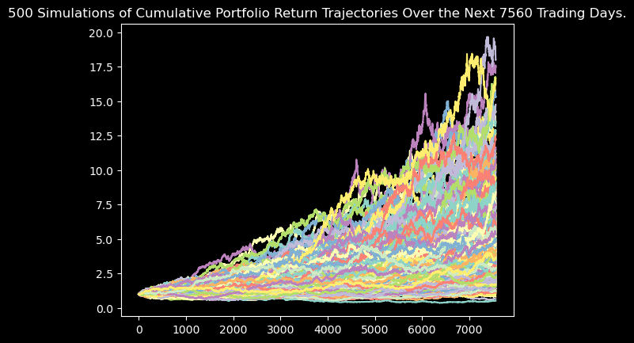
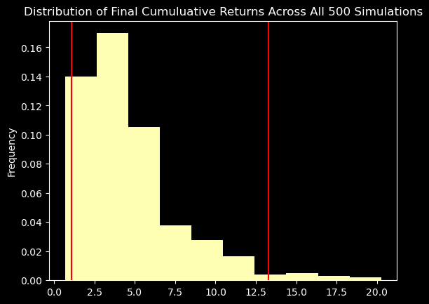
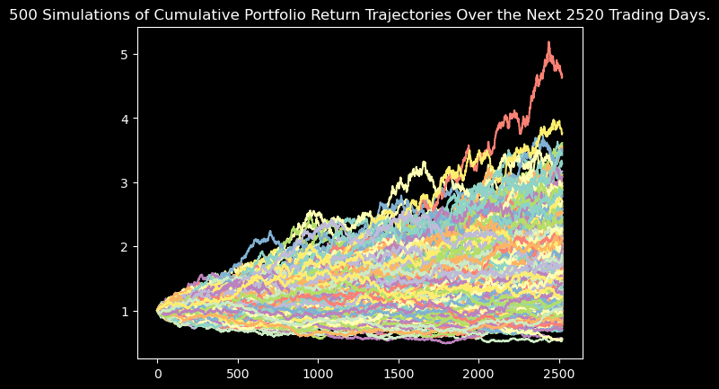
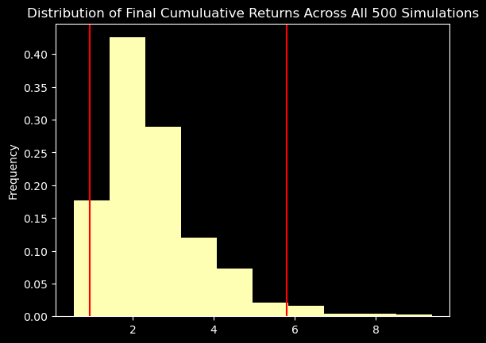

# Columbia Engineering FinTech Bootcamp 2023-06

> Project: Module 5 API challenge assignment

>Purpose: In this activity, we used our newfound Python API and Monte Carlo simulation skills to create a Python script in Jupyter Notebook that generates the following:
>1. A financial planner for emergencies; and
>2. A financial planner for retirement.

## Table of Contents
* [General Info](#general-information)
* [Technologies Used](#technologies-used)
* [Features](#features)
* [Screenshots](#screenshots)
* [Setup](#setup)
* [Usage](#usage)
* [Project Status](#project-status)
* [Room for Improvement](#room-for-improvement)
* [Acknowledgements](#acknowledgements)
* [Contact](#contact)
<!-- * [License](#license) -->

## General Information
- Our project was designed to use API calls and a custom Monte Carlo simulation module to create financial planning tools: a planner for emergencies and a planner for retirement forecasting. 

## Technologies Used
- Python Version 3.10.12
- Jupyter Notebook within the VS Code IDE for both Jupyter Notebook 'financial-planner.ipynb' and a README.MD markdown file.

## Features

## Screenshots
##### Sample project screenshots:

## Setup
- GitHub Repository
    - name: 'api-challenge'
    - location: uploaded to Bootcamp homework submission online portal and available publicly at:
    git@github.com:boz-tcm/api-challenge.git
- Python Standard Library (Version 3.10.12)
- Python Modules:
    - pandas
    - matplotlib
    - pathlib and Path function
    - os
    - requests
    - from dotenv import load_dotenv
    - alpaca_trade_api
    - from MCForecastTools import MCSimulation
    - json
    - from pandas.tseries.holiday import USFederalHolidayCalendar
    - from pandas.tseries.offsets import CustomBusinessDay
    - pytz
- Jupyter Notebook(s):
    - name: 'financial-planner.ipynb'
    - location: 'api-challenge/'
- Python Script(s):
    - name: 'MCForecastTools.py'
    - location: 'api-challenge/'

## Usage
The script is run in the Jupyter Notebook 'financial-planner.ipynb', within the 'api-challenge' directory, executed using the Notebook environment's 'Run All Cells...' command.

The custom Monte Carlo library 'MCForecastTools.py' should also be located within the same directory as the main notebook 'financial-planner.ipynb' in order to execute the 'MCSimulation' class module.

## Project Status
Project is: _complete

## Room for Improvement
Room for improvement:

To do:

## Acknowledgements
Give credit here.

## Contact
Created by Todd C. Meier, tmeier@bozcompany.com - feel free to contact me!

<!-- ## License --> All rights reserved.